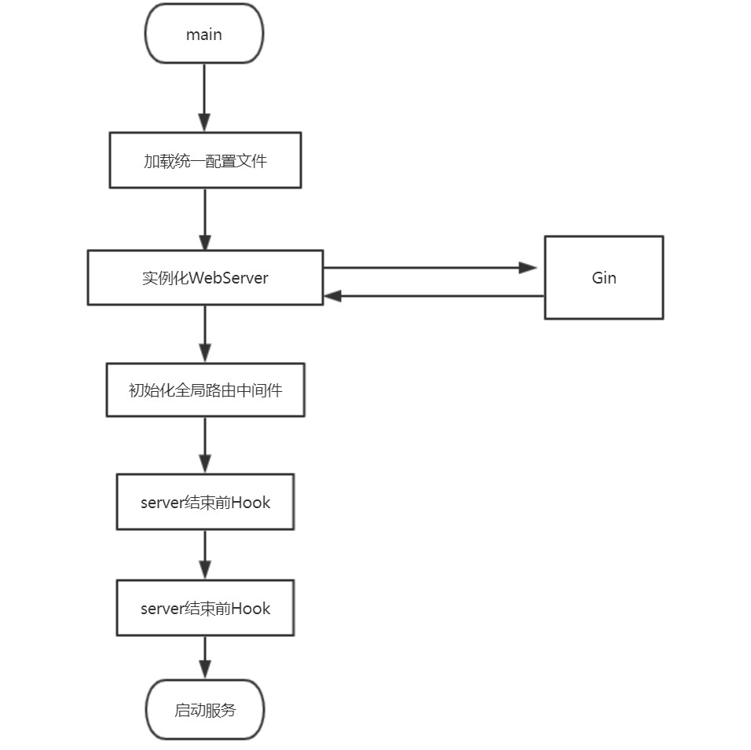

### 路由中间件
------

#### 中间件设计
在Gaea中，Gin其实是扮演者web引擎的角色，在其基础上，我们的增强功能都“遵循支持可插拔”的思想来开发，所有功能用户可以自由选择开启或关闭
，执行流程示意图如下：


用户可在中间层和hook处增加自定义逻辑
比如，我们把一些基础组件作为一个个独立的中间件来灵活地选择性加载。

#### 全局默认加载
main/main.go
```go
func main() {
	//show version
	ver := flagutil.GetVersion()
	if *ver {
		version.Version()
		return
	}
	//init conf
	confutil.InitConfig()

	defer recovery()
	s := ginhttp.NewServer()
	engine := s.GetGinEngine()
	//全局默认加载中间件
    //挂在中间件的位置
	//engine.Use()

	router.RegisterRouter(engine)

	//服务启动前hooks
	s.AddServerBeforeFunc(bs.InitLoggerWithConf(), bs.InitTraceLogger("XueYan", "0.1"), bs.InitPerfutil(), bs.InitPprof(), s.InitConfig())

	//服务停止hooks
	s.AddServerAfterFunc(bs.CloseLogger())

	er := s.Serve()
	if er != nil {
		log.Printf("Server stop err:%v", er)
	} else {
		log.Printf("Server exit")
	}
}
```

#### 自定义插件
插件是个类型 `gin.HandlerFunc`, 只要符合此类型的定义即为一个插件！ 如下是一个简单的例子

```go
package middleware

import (
"fmt"
"github.com/gin-gonic/gin"
)

func myMiddleWare() gin.HandlerFunc {
	return func(c *gin.Context) {
		fmt.Println("xxx")
	}
}
```
